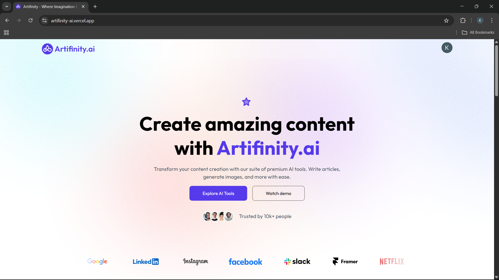
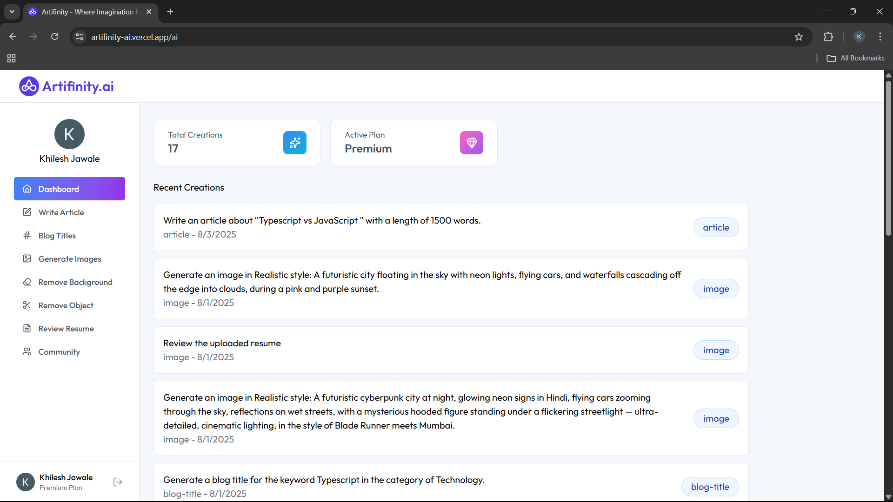
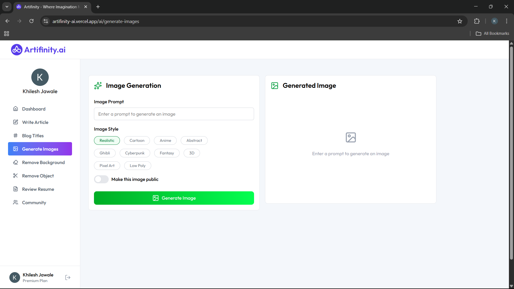
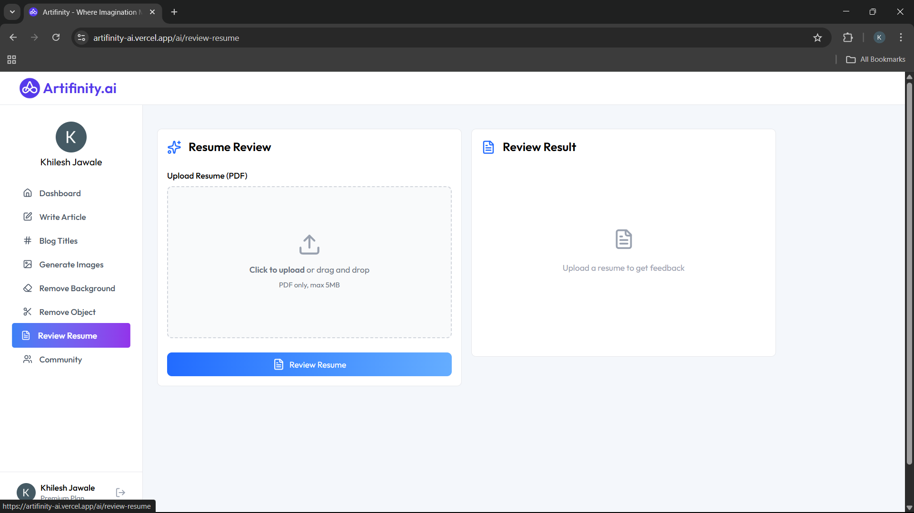
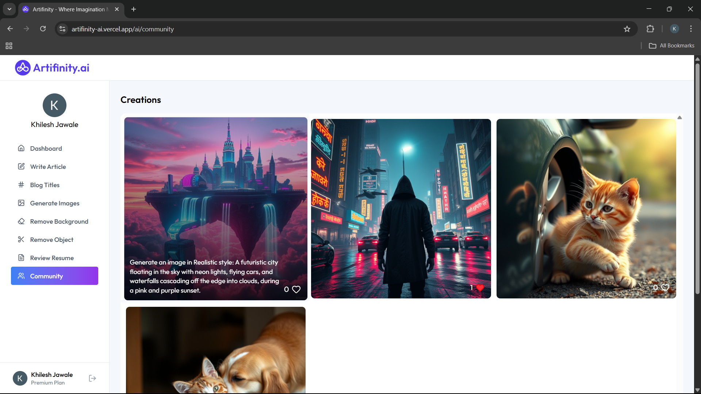

# Artifinity.ai - AI Based Web App


### 🏠 Home Page



### 📊 Dashboard



### 🎨 Generate Image Page



### 📄 Review Resume Page



### 👥 Community Page


Artifinity.ai is a full-stack web application that leverages advanced AI models to generate articles, blog titles, images, and more. It features user authentication, premium/free plan management, and a modern React frontend.

## Features

- ✍️ **AI Article Writer**: Generate high-quality articles on any topic.
- 🏷️ **Blog Title Generator**: Create catchy blog titles with AI.
- 🖼️ **AI Image Generation**: Generate images from text prompts.
- 🧹 **Background/Object Removal**: Remove backgrounds or objects from images.
- 📄 **Resume Reviewer**: Get AI-powered feedback on your resume.
- 👥 **Community**: Like and view published creations from other users.
- 🔒 **Authentication**: Secure login/signup with Clerk.
- 💎 **Premium/Free Plans**: Usage limits for free users, unlimited for premium.

## Tech Stack

- **Frontend**: React, Vite, Clerk, Tailwind CSS
- **Backend**: Node.js, Express, MongoDB (Mongoose), Clerk, Multer, Cloudinary
- **AI Providers**: Google Gemini (LLM), ClipDrop (image), Cloudinary (image hosting)

## Getting Started

### Prerequisites

- Node.js (v18+ recommended)
- MongoDB Atlas account (or local MongoDB)
- Clerk account (for authentication)
- Google Gemini API key (for LLM)
- Cloudinary account (for image hosting)

### Installation

1. **Clone the repository:**

	```sh
	git clone https://github.com/khilesh321/Artifinity.ai---AI-based-Web-App.git
	cd Artifinity.ai---AI-based-Web-App
	```

2. **Install dependencies:**

	```sh
	cd backend && npm install
	cd ../frontend && npm install
	```

3. **Set up environment variables:**

	- Copy `.env.example` to `.env` in both `backend/` and `frontend/`.
	- Fill in your MongoDB, Clerk, Gemini, and Cloudinary credentials.

4. **Start the backend server:**

	```sh
	cd backend
	npm run dev
	```

5. **Start the frontend app:**

	```sh
	cd ../frontend
	npm run dev
	```

## Usage

- Register or log in with Clerk.
- Use the dashboard to generate articles, blog titles, images, and more.
- Free users have limited usage; upgrade to premium for unlimited access.

## API Endpoints (Backend)

- `POST /api/ai/generate-article` — Generate an article
- `POST /api/ai/generate-blog-title` — Generate a blog title
- `POST /api/ai/generate-image` — Generate an image
- `POST /api/ai/remove-image-background` — Remove image background
- `POST /api/ai/remove-image-object` — Remove object from image
- `POST /api/ai/resume-review` — Review a resume
- `GET /api/user/get-user-creations` — Get user's creations
- `GET /api/user/get-published-creations` — Get all published creations
- `POST /api/user/toggle-like-creation` — Like/unlike a creation

## Contributing

Pull requests are welcome! For major changes, please open an issue first to discuss what you would like to change.

> **Artifinity.ai** — Unleash your creativity with AI.
